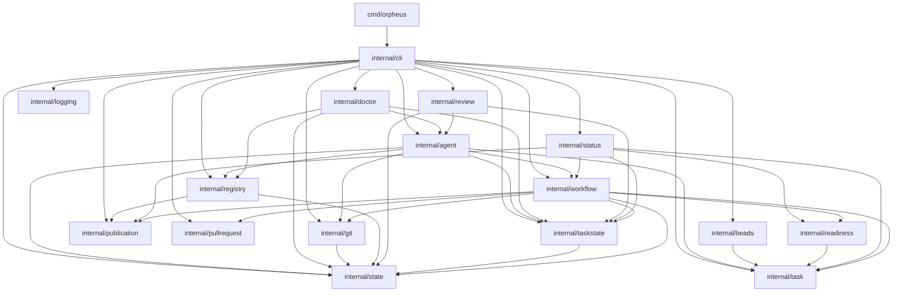

# Architecture

## High-Level Overview

Orpheus is a daemonless Go CLI that coordinates coding-agent work across registered repositories. Each invocation builds the required services, reads the current local state, performs one explicit operation, and exits. Long-running work is limited to attached agent or review processes started by the invoking command.

The architecture uses a pragmatic layered structure:

- `cmd/orpheus` and `internal/cli` form the executable and presentation layer. The CLI is also the composition root that connects concrete adapters to application services.
- `internal/workflow`, `internal/review`, `internal/agent`, and `internal/doctor` implement the main task, review, agent execution, and local diagnostic use cases.
- `internal/task`, `internal/taskstate`, `internal/readiness`, `internal/status`, and `internal/publication` define the core models, policies, state transitions, and operator-facing projections.
- `internal/beads`, `internal/git`, and `internal/pullrequest` adapt external command-line tools. `internal/registry`, `internal/state`, and `internal/logging` provide local infrastructure.

State ownership is intentionally split. The configured task backend, currently Beads, is authoritative for task lifecycle data such as task identity, status, relations, and Orpheus workflow pointers stored in task metadata. Orpheus owns the repository registry and per-task execution history, including targets, agent runs, completions, reviews, finalization facts, and audit events. Orpheus persists its state as human-readable YAML below the XDG config and data roots.

The main runtime integrations are the `bd`, `git`, and `gh` executables, configured agent executables, and optional review tools such as Hunk. The primary Go dependencies are Cobra for the command tree and `yaml.v3` for configuration and state files.

## Main Runtime Flow

1. `internal/cli` resolves XDG paths and loads the registered repository catalog.
2. A task ID is mapped to a repository and Beads workspace through `internal/task` and `internal/registry`; `internal/beads` supplies the task data.
3. `internal/workflow` validates readiness, prepares a deterministic Git target, updates backend metadata, and records a run in `internal/taskstate`.
4. `internal/agent` resolves a configured profile, launches the attached process, renders its validated context, and records its completion and usage facts.
5. `internal/review` executes the selected read-only review pipeline and persists steps and findings in `internal/taskstate`.
6. After a passed review, `internal/workflow` commits and publishes the reviewed changes. Default-branch work is pushed and closed directly; feature-branch work is pushed and opened as a pull request.
7. Later sync commands poll recorded pull requests, update open task branches from the registered default branch, close merged backend tasks, and add local audit events. `internal/status` combines backend snapshots with Orpheus-owned state into the operator action queue.

The independent `doctor` flow scans registered repositories and Orpheus-owned task state for recoverable local inconsistencies. Its first diagnostic correlates missing Codex usage facts with local session logs and mutates task state only when the operator supplies `--fix` and the match is safe.

## Package Dependency Graph

An arrow from package A to package B means that A directly imports B in production code. Standard-library and third-party imports are omitted.

The graph is acyclic. The leaf packages with no imports of other project packages are `internal/logging`, `internal/publication`, `internal/pullrequest`, `internal/state`, and `internal/task`.

In dependency-direction terms, `internal/state`, `internal/task`, `internal/publication`, `internal/pullrequest`, and `internal/logging` provide lower-level contracts or infrastructure. `internal/beads`, `internal/git`, and `internal/registry` adapt external or local resources into those contracts. `internal/taskstate` and `internal/readiness` own persisted execution state and shared policy. `internal/agent`, `internal/doctor`, `internal/review`, `internal/status`, and `internal/workflow` are application packages that combine lower-level concepts, while `internal/cli` is the composition and presentation package.

## Package Responsibilities

### `cmd/orpheus`

- Provides the process entry point, executes the root Cobra command, prints terminal errors, and maps command failure to a non-zero process exit.

### `internal/agent`

- Integrates configured coding agents by loading and validating implementer and reviewer profiles, interpolating command arguments, launching attached processes, and distinguishing process-start failures from runtime failures.
- Owns the agent-facing execution contract: it resolves active implementation or review context from environment, registry, backend, task-state, and workflow-target facts; renders backend-neutral prompts; and records idempotent implementation completion handoffs.
- Captures agent execution telemetry where supported, currently by correlating Codex session logs, and estimates API-equivalent cost for recognized models.

### `internal/beads`

- Adapts the `bd` CLI to Orpheus' backend-neutral task contracts, including task reads, task creation, dispatch metadata updates, pull-request URL updates, closure, JSON translation, and idempotent mutation checks.
- Discovers and validates repository-local Beads state or initializes an isolated Orpheus-managed Beads workspace while sanitizing environment variables and producing actionable command diagnostics.

### `internal/cli`

- Defines the Cobra command tree and all operator-facing and agent-facing command handlers for repository registration/configuration, task inspection and execution, reviews, completion, finalization, synchronization, statistics, and global status.
- Acts as the application composition root by resolving environment-backed paths, constructing registries and adapters, wiring workflow services, selecting agent and review configuration, and coordinating interactive confirmation and input.
- Owns terminal presentation concerns such as tables, responsive status rendering, watch behavior, TTY detection, progress output, command help, and separation of normal output from diagnostics.

### `internal/doctor`

- Runs local, cross-repository diagnostics over registered repositories and Orpheus-owned task state, returning structured outcomes for CLI rendering.
- Owns safe repair policy for recoverable local facts. The current diagnostic re-correlates missing Codex execution usage from local session logs and persists only unique or safely disambiguated matches when explicitly requested.

### `internal/git`

- Adapts local Git operations used by the application, including repository inspection, remote and default-branch discovery, branch and working-tree checks, staging, commits, and pushes.
- Computes, creates, validates, reuses, or recovers the supported deterministic execution targets: dedicated task worktrees, repo-root task branches, and the repo-root default branch. It conservatively rejects dirty, divergent, or mismatched Git state before unsafe mutations.

### `internal/logging`

- Constructs structured application-diagnostic loggers with verbose-level control and a safe discard implementation, keeping diagnostics on the caller-supplied stream and separate from command output.

### `internal/publication`

- Defines repository-configurable publication title policy by validating supported placeholders, determining whether an external task reference is required, and rendering commit or pull-request titles.

### `internal/pullrequest`

- Defines the provider-neutral pull-request contract and lifecycle model used by workflows.
- Implements that contract with the GitHub CLI, including open-PR recovery by branch, PR creation, status polling by URL, response validation, and actionable provider/authentication error classification.

### `internal/readiness`

- Evaluates backend-neutral readiness policies that are shared by dispatch and status projection. The current policy gates a child task on the state and type of its immediate parent epic and explains blocked or inconsistent relationships.

### `internal/registry`

- Persists and validates the machine-local repository catalog, including canonical identity, paths, Git defaults, Beads mode/prefix, publication policy, and review-pipeline selection and aliases.
- Resolves repository tokens and deterministic local resources, particularly the local or managed Beads workspace, while preventing identity, path, prefix, and configuration collisions.

### `internal/review`

- Loads, validates, and selects ordered review pipelines from shared configuration, with a built-in manual fallback and support for check, manual, and agent-review steps.
- Executes review pipelines and records their steps and automated findings through `internal/taskstate`, including attached reviewer processes, operator decisions for blockers, optional Hunk notes, and bounded interactive output.
- Enforces the read-only review boundary by snapshotting candidate changes around every step and restoring them when a review command or agent mutates the candidate tree.

### `internal/state`

- Resolves and confines XDG-backed configuration and data paths, creates owned directories, and provides strict YAML reads plus atomic YAML replacement for package-owned state.
- Provides the fail-fast global mutation lock used to serialize state-changing repository, dispatch, completion, synchronization, and finalization operations.

### `internal/status`

- Projects cross-repository backend snapshots and local Orpheus task-state facts into the ordered operator action queue: needs attention, reviewing, working, idle, ready, blocked, and done.
- Applies the canonical local readiness and next-action policy, including dependency state, parent-epic gating, publication requirements, run/review/finalization state, target consistency, and partial repository failures. It also supplies the ready-task view used by the CLI.

### `internal/task`

- Defines the backend-neutral task and repository model, Orpheus metadata projection, relation data, lifecycle statuses, and narrow read/mutation capability interfaces consumed by higher layers.
- Resolves prefixed task IDs to registered repository sources and aggregates task reads across repositories while preserving repository context and partial failures.

### `internal/taskstate`

- Owns the versioned, per-task Orpheus execution aggregate stored at `repos/<repo-id>/tasks/<task-id>.yaml`, including the locked target, agent runs and usage, completion handoffs, review attempts and findings, finalization facts, and audit events.
- Provides validated and mostly idempotent state transitions for run, review, finding-resolution, publication, closure, and failure recording, together with query helpers for the latest or active lifecycle facts.

### `internal/workflow`

- Defines and classifies the supported execution targets and review lifecycles, reconciling expected Git locations with backend metadata and the canonical target stored in `internal/taskstate`.
- Orchestrates the task lifecycle through narrow backend, Git, PR-provider, and run-store contracts: dispatch and retry setup, attached-run outcomes, review follow-up targeting, review-gated default-branch finalization, feature-branch publication, open-PR branch updates, PR polling, merged-task closure, and batch sync.
- Builds publication handoffs from task data and persisted completion/review history, including repository title policy and concise review-process details for pull requests.

## Evolution Decisions

The current CLI is the only planned frontend, but application behavior must remain independent of Cobra and terminal I/O so that other frontends can be added later. Frontend-specific parsing, prompting, and rendering belong in `internal/cli`; reusable use-case transitions belong in application packages.

`internal/workflow` is the long-term owner of complete task lifecycle orchestration. `internal/review` remains the review-pipeline engine, while `internal/agent` provides agent-facing context and completion behavior. Moving the review lifecycle out of `internal/cli` is deferred until the supporting package boundaries can be changed together.

Beads is the first task source, not the permanent task model. Core task contracts remain source-neutral. Source-specific identifiers, workspaces, commands, and translation belong in adapters such as `internal/beads` and in registry configuration that selects and configures those adapters.

`registry.Repo` is the persisted repository schema. The registry boundary should eventually translate it into one validated application repository projection instead of requiring CLI and agent code to keep persisted and application models synchronized.

Only the latest task-state schema is supported before a stable release. Older local state is intentionally rejected, and no migration mechanism is maintained while Orpheus has a single user who can recreate or update local state directly.

Dependencies are wired manually once per invocation. Future composition cleanup should preserve explicit constructor and interface wiring rather than introduce a dependency-injection framework. Package dependency rules should become executable checks after the deferred package moves establish the intended graph.
